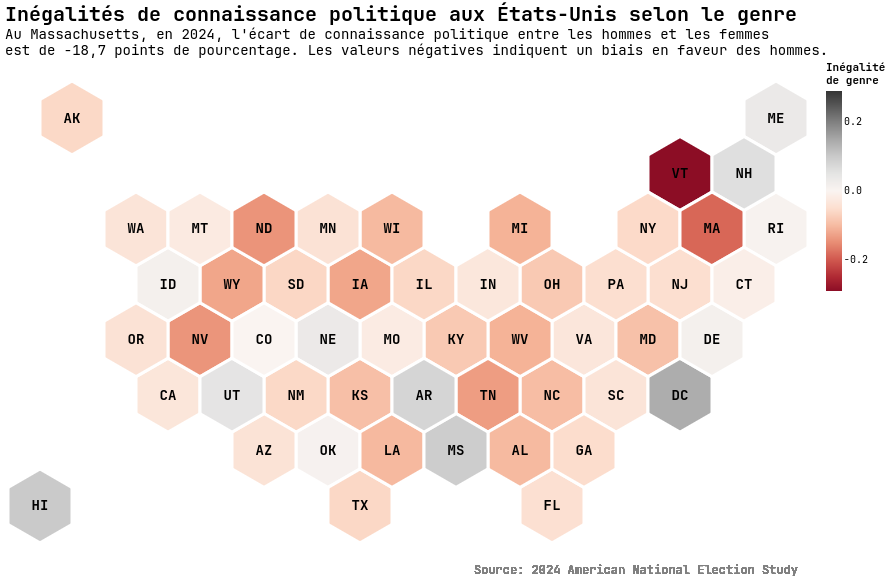

# Initiation à la Data Visualisation

Comment faire passer un message simple à partir d'informations complexes ?  
Dans un monde où les données sont omniprésentes, la capacité à produire des visualisations est devenue une compétence essentielle pour les journalistes, chercheur·e·s ou tout·e professionnel·le se confrontant à des données dans ses travaux ou sa prise de décision.

Cet atelier propose une initiation progressive à la data visualisation à l'aide du langage Python. Aucun prérequis dans ces domaines n'est exigé.

    

En s'inscrivant dans une réflexion sur les usages de la dataviz en sciences sociales, il s'agira d'apprendre à manipuler et simplifier des données empiriques pour produire des visualisations claires ayant un message précis. Tout au long du module des thèmes tels que la polarisation, le knowledge gap, la participation électorale ou encore la confiance politique seront explorés.

### À la fin du semestre, vous saurez

- Concevoir et produire des graphiques pour vos projets.
- Réaliser les étapes clés d'un projet de visualisation : chargement, préparation, analyse, et production graphique.
- Choisir un type de visualisation pertinent selon les données et le message que vous souhaitez véhiculer.
- Mobiliser des bibliothèques Python devenues incontournables en data visualisation.

### Format du cours et programme prévisionnel

Les séances sont organisées en format atelier. Chaque séance comportera une dimension pratique, avec des temps d'application et exercices sur des cas concrets. Le module est organisé en séquences progressives : (1) installation de l’environnement de travail, (2) introduction au traitement et la manipulation de données, (3) réalisation de différents types de visualisations.

Bloc 1 – Mise en place & premiers pas (2 séances)  
*Objectif : permettre à chacun·e de disposer d’un environnement de travail fonctionnel*

- Présentation du cours et des attendus
- Présentation de l'environnement de développement (Google Colab) et prise en main
- Exécution d’une première visualisation à partir d'un code fourni par les enseignants

Bloc 2 – Initiation à Python et à Pandas (4 séances)  
*Objectif : acquérir les bases de la programmation et du traitement de données*

- Syntaxe de base en Python
- Introduction à Pandas : chargement de bases, nettoyage, recodage, analyse
- Manipulation de variables et statistiques descriptives
- Préparation des données pour la visualisation

Bloc 3 – Visualisation de données (6 séances)  
*Objectif : maîtriser les grands types de visualisation selon la nature des variables*

- Visualisations univariées : histogrammes, barplots, boxplots
- Visualisations bivariées : scatterplots, courbes, boxplots croisés
- Visualisations cartographiques : initiation à la visualisation spatiale (hexbin maps, cartes choroplèthes)

*Ce programme est provisoire et est susceptible de changer selon les besoins des étudiant.es et le déroulement du cours.*

<!-- TODO: raffiner les types de visualisation qui seront présentées -->

### Calendrier et créneaux horaire

Selon le groupe et l'enseignant.

### Modes de validation

Ce module, adoptant une approche incrémentale, propose une évaluation continue par la remise de rendus intermédiaires.
Les rendus débouchent sur un rendu final prenant la forme d'une infographie aboutie.

 | Date rendu           | Évaluation                                                              | Poids | Description                                                                 |
 |----------------------|-------------------------------------------------------------------------|-------|-----------------------------------------------------------------------------|
 | Séance 5             | Modifications de titres/sous-titres                                     | 10%   | Capacité à choisir des éléments éditoriaux clairs et pertinents             |
 | Séance 7             | Identification de deux variables et calcul de statistiques descriptives | 10%   | Rigueur dans le choix des variables et la qualité du traitement             |
 | Séance 9             | Prototype de visualisation univariée                                    | 10%   | Pertinence du graphique et lisibilité                                       |
 | Séance 11            | Prototype de visualisation bivariée                                     | 10%   | Pertinence du graphique et lisibilité                                       |
 | Final (**10 avril**) | Figure finale                                                           | 60%   | Une visualisation aboutie, respectant tous les critères de qualité attendus |

**Critères de réussite de la figure finale :**

- un code fonctionnel, reproductible de bout en bout
- qui charge la base de données
- identifie les variables
- les prépare
- crée une figure avec :
  - un titre explicite
  - un sous titre donnant un exemple de lecture
  - une source
  - une mise en forme adéquate
- enregistre la figure dans un format de sortie adapté (png, pdf, html…)

### Liens Utiles

#### Liens Séance 1

- [slides-S1](https://sciencespobordeaux.github.io/data-viz/slides/slides-S1/slides-1.html)
- [Demo_intro](https://githubtocolab.com/SciencesPoBordeaux/data-viz/blob/main/notebooks/demo_intro.ipynb)
- [Donnés: ANES 2024](https://electionstudies.org/data-center/2024-time-series-study/)

#### Prendre RDV
- [Mickael Temporão](https://calendar.app.google/AU48bCi41zpUHgCh6)

### Bibliographie

- [From Data to Viz](https://www.data-to-viz.com/)
- [Dataviz Catalogue](https://datavizcatalogue.com/)
- [Fundamentals of Data Visualization](https://clauswilke.com/dataviz/)
- et une liste de ressources [ici](https://github.com/SciencesPoBordeaux/data-viz/blob/main/ressources.md)

### À propos
<!-- TODO : PRÉCISER LES TYPES DE NUMÉROS DE CLAQUETTES POUR BROADWAY ? -->

Léo Mignot et Mickael Temporão sont spécialistes dans la réalisation **de numéros de claquettes**.

